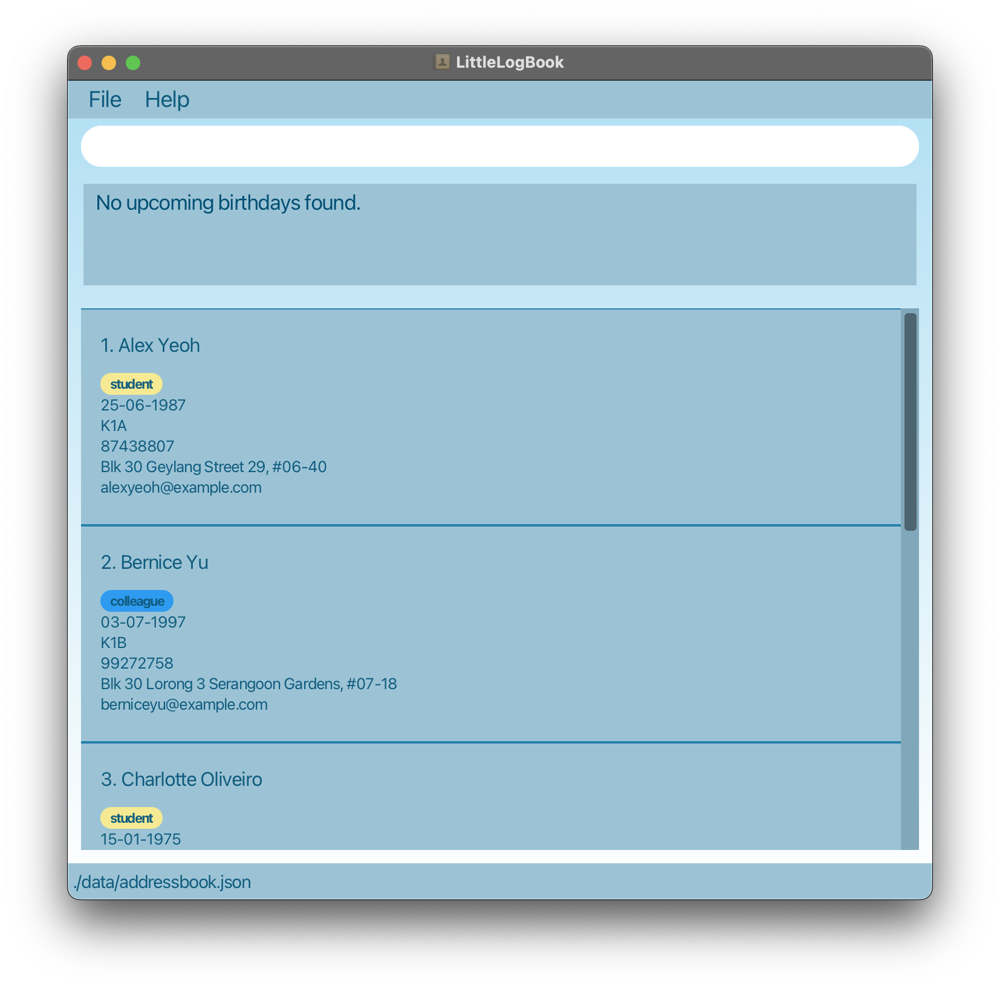
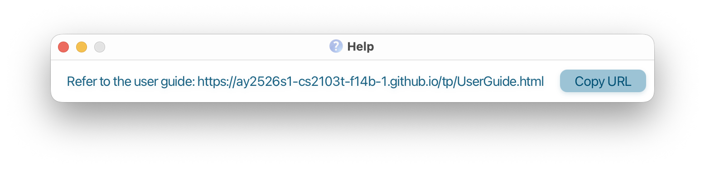
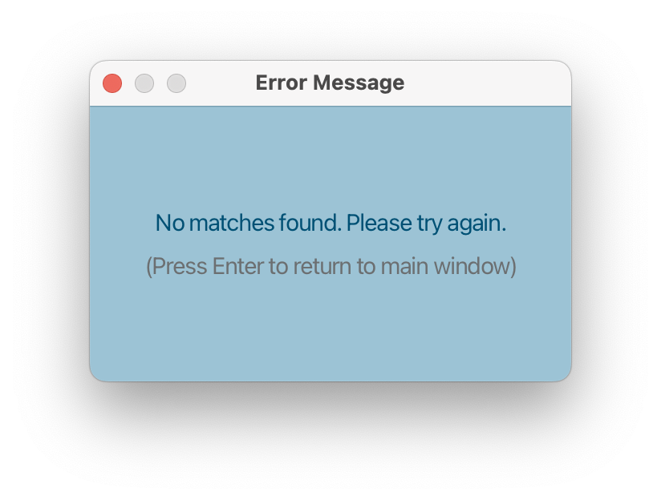
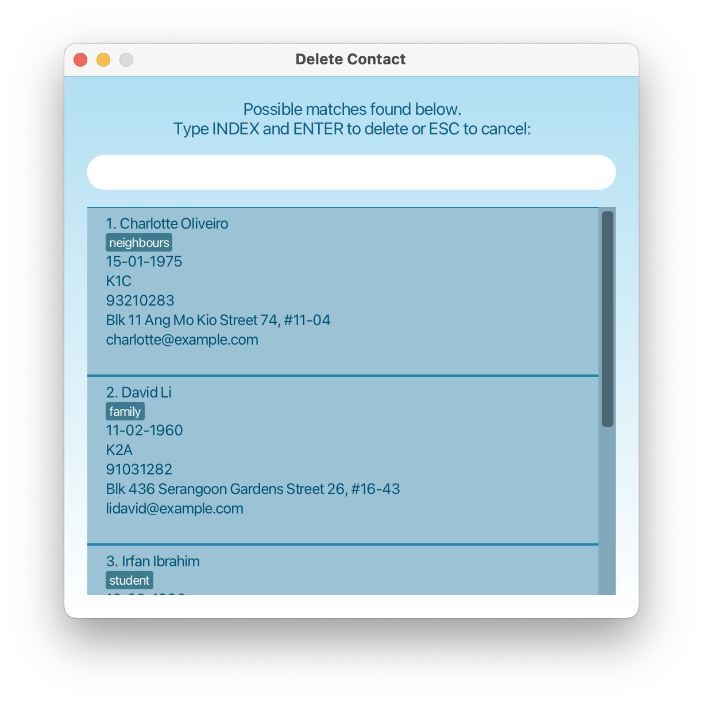
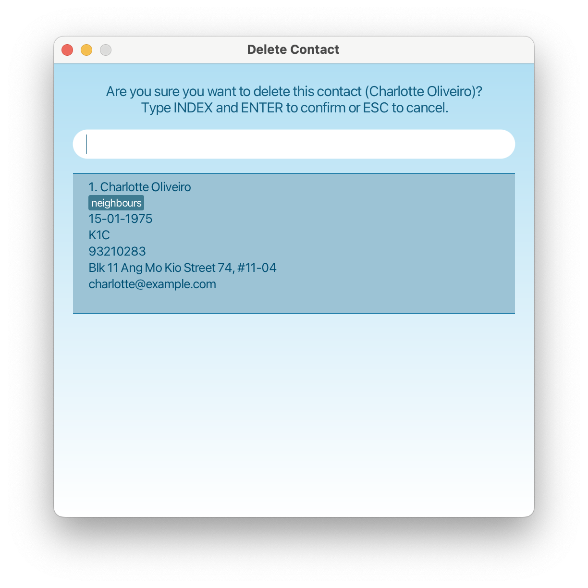
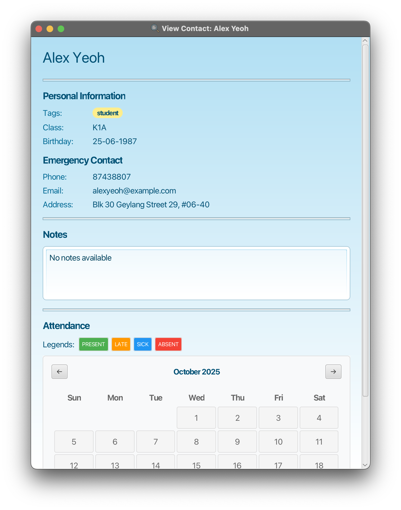

# LittleLogBook

## Product description
LittleLogBook helps **kindergarten teachers** keep track of **students' and parents' information** with ease.
Unlike traditional contact management tools, LittleLogBook is optimised for fast typing and minimal clicking, making it ideal for teachers who prefer keyboard-driven workflows.

## Target User
LittleLogBook is designed for kindergarten teachers who need to
manage students' and parents' contact information efficiently.

**Assumptions** about our target user:
1. A kindergarten teacher who is an avid user of typed user commands
(able to use Command prompt/terminal).
2. The teacher teaches multiple classes, each containing multiple students.
3. The teacher will also have multiple colleagues to work with.

<!-- * Table of Contents -->
<page-nav-print />

--------------------------------------------------------------------------------------------------------------------

## Quick start

1. Ensure you have Java `17` or above installed in your Computer.
   <box type="warning">
   <strong>Mac users:</strong> Ensure you have the precise JDK version prescribed
   <a href="https://se-education.org/guides/tutorials/javaInstallationMac.html">here</a>.
   </box>

1. Download the latest `.jar` file from [here](https://github.com/AY2526S1-CS2103T-F14B-1/tp).

1. Copy the file to the folder you want to use as the _home folder_ for your LittleLogBook.

1. Open and navigate to your jar file using command terminal:

[//]: # (EXPLANATION BLOCK)
<div style="background: #f5f5f5; padding: 15px; border-radius: 5px; border-left: 4px solid #ffd519;">
<strong>What is <code>cd</code>?</strong> <code>cd</code> stands for "change directory" - it's a command that lets you navigate to different folders on your computer through the command line.
</div>
<br>

   **Step-by-step instructions:**
   
   1. **Navigate to the jar file folder:**
      - Windows: Open Command Prompt and run `cd C:\path\to\LittleLogBook`
      - Mac/Linux: Open Terminal and run `cd /path/to/LittleLogBook`

<box type="tip">
<strong>Tip:</strong> Replace the path with your actual folder location containing the jar file.
</box>

   2. **Run the application:**
        ```shell
        java -jar littlelogbook.jar
        ```

   1. **Alternative method (easier for beginners):**
      - Navigate to the folder containing `littlelogbook.jar` using your file explorer
      - **Windows:** Hold Shift + Right-click in the empty space of the folder → Select "Open PowerShell window here" or "Open command window here"
      - **Mac:** Right-click in the folder → Services → New Terminal at Folder
      - **Linux:** Right-click in the folder → "Open in Terminal"
      - Type `java -jar littlelogbook.jar` and press Enter

   A GUI similar to the below should appear in a few seconds. Note how the app contains some sample data.<br>

<div style="text-align: center;">

</div>

5. Type the command in the command box and press Enter to execute it. e.g. typing **`help`** and pressing Enter will open the help window.<br>
   Some example commands you can try:

   * `add n/John Doe p/98765432 e/john.doe@gmail.com a/Blk 456, Den Road, #01-355 c/K1A` : Adds a contact named `John Doe` with class `K1A` to LittleLogBook.

   * `edit 1 n/Bob` : Edit the first contact's name to `Bob`.

   * `delete n/Bob` : Deletes the contact named `Bob`.

   * `exit` : Exits the app.

1. Refer to the [Features](#features) below for details of each command.

--------------------------------------------------------------------------------------------------------------------

## Features

<box type="info" seamless>

**Notes about the command format:**<br>

* Words in `UPPER_CASE` are the parameters to be supplied by the user.<br>
  e.g. in `add n/NAME`, `NAME` is a parameter which can be used as `add n/John Doe`.

* Items in square brackets are optional.<br>
  e.g `n/NAME [t/TAG]` can be used as `n/John Doe t/friend` or as `n/John Doe`.

* Items followed by ellipsis `...` accept more than one value.<br>
  e.g `c/CLASS...` can be used as `c/K1A` or as `c/K1A c/K2B`.

* Parameters can be in any order.<br>
  e.g. if the command specifies `n/NAME p/PHONE`, `p/PHONE n/NAME` is also acceptable.

* Extraneous parameters for commands that do not take in parameters (such as `help`, `list`, `exit` and `clear`) will be ignored.<br>
  e.g. if the command specifies `help 123`, it will be interpreted as `help`.

* If you are using a PDF version of this document, be careful when copying and pasting commands that span multiple lines as space characters surrounding line-breaks may be omitted when copied over to the application.
</box>

<box type="info" seamless>

**Notes about the parameters and validation rules:**<br>

* Mandatory parameters will be colored <span style="color: #e83f8b">**PINK**</span>.

* Optional parameters will be colored <span style="color: #6b7280">**GREY**</span>.

</box>

### Viewing help : `help`

**Purpose**: Shows a message explaining how to access the help page.

##### Command Format
```shell
help
```

##### Parameters & Validation Rules

* **No parameters accepted.**
* Any extraneous text after `help` will be ignored (treated as `help`).

##### Outputs
|                Outcome Type                   | Scenario            | Message                    | GUI Action                                           |
|:---------------------------------------------:|---------------------|----------------------------|------------------------------------------------------|
| <span style="color: green">**Success**</span> | Help window appears | `Opened help window.`      | Pop-up window appears with the link to the help page |

<div style="text-align: center;">
    <strong>Help window appears</strong><br>
    
</div>

[//]: # (COMMAND BREAK)
<br>

### Adding a contact: `add`

**Purpose**: Allows teachers to create a new contact entry for students or colleagues.

##### Command Format
```shell
add n/NAME p/PHONE e/EMAIL a/ADDRESS c/CLASS b/BIRTHDAY t/TAG [desc/NOTE]
```

##### Parameters & Validation Rules
|                       Parameter                       | Validation Rules                                                         |
|:-----------------------------------------------------:|--------------------------------------------------------------------------|
|   <span style="color: #e83f8b">**NAME (n/)**</span>   | Alphabetic characters, spaces, hyphens, apostrophes only                 |
|                                                       | Leading/trailing spaces trimmed, multiple spaces collapsed               |
|                                                       | Case-insensitive for duplicates                                          |
|                                                       | Error if empty or contains numbers/symbols                               |
|  <span style="color: #e83f8b">**PHONE (p/)**</span>   | 8-digit Singapore numbers starting with 6 (landline), 8, or 9 (mobile)   |
|                                                       | Valid formats: 6XXXXXXX (landline), 8XXXXXXX or 9XXXXXXX (mobile)        |
|                                                       | Examples: 61234567, 81234567, 91234567                                   |
|                                                       | Spaces/dashes ignored (e.g., 9123-4567 or 9123 4567)                     |
|                                                       | Error if not numeric, wrong length, or invalid starting digit            |
|  <span style="color: #e83f8b">**EMAIL (e/)**</span>   | Must follow standard email format                                        |
|                                                       | Case-insensitive                                                         |
|                                                       | Error if invalid format                                                  |
| <span style="color: #e83f8b">**ADDRESS (a/)**</span>  | Any non-blank text                                                       |
|                                                       | Error if empty or contains only whitespace                               |
|  <span style="color: #e83f8b">**CLASS (c/)**</span>   | Valid kindergarten classes: K1A, K1B, K1C, K2A, K2B, K2C, Nursery, Pre-K |
|                                                       | Case-insensitive                                                         |
|                                                       | Error if invalid class format                                            |
| <span style="color: #e83f8b">**BIRTHDAY (b/)**</span> | Date in dd-MM-yyyy format                                                |
|                                                       | Must be a valid date (from 01-01-1900 to today's date)                   |
|   <span style="color: #e83f8b">**TAG (t/)**</span>    | Exactly one tag                                                          |
|                                                       | Must be either 'student' or 'colleague' (case-insensitive)               |
| <span style="color: #6b7280">**NOTE (desc/)**</span>  | Any text up to 500                                                       |
|                                                       | Leading/trailing spaces trimmed                                          |

<box type="warning">
<strong>Duplicate Contact Detection:</strong><br>
The system uses different rules for detecting duplicates based on contact type:<br><br>

<strong>For Colleagues (t/colleague):</strong><br>
• Duplicate if: same phone number OR same email address<br>
• Colleagues can have the same name but must have unique phone numbers and email addresses<br><br>

<strong>For Students (t/student):</strong><br>
• Duplicate if: same name AND phone number<br>
• Allows different students to share the same phone (e.g., siblings with same emergency contact)<br><br>

<strong>Error Message:</strong> <code>Duplicate contact detected. For colleagues: ensure unique phone numbers and email addresses. For students: ensure unique name-phone combinations.</code><br>

<strong>Resolution:</strong><br>
• **For Colleagues:** Ensure unique phone numbers and email addresses<br>
• **For Students:** Ensure unique name-phone combinations
</box>

##### Sample Commands
```shell
add n/John Doe p/98765432 e/john.doe@gmail.com a/Blk 456, Den Road, #01-355 c/K1A b/15-03-2018 t/student
```
```shell
add n/Mary Tan p/91234567 e/marytan@e.nut.edu a/123 Jurong West Ave 6 c/K2B b/24-12-2017 t/colleague desc/Allergic to peanuts
```

##### Outputs
|                Outcome Type                   | Scenario                   | Message                                                    | GUI Action                            |
|:---------------------------------------------:|----------------------------|------------------------------------------------------------|---------------------------------------|
| <span style="color: green">**Success**</span> | New contact added          | `New <contact> added`                                      | Contact list refreshes with new entry |
|  <span style="color: red">**Failure**</span>  | Missing required parameter | `Invalid command format!` _(with correct format guidance)_ | No changes                            |
|  <span style="color: red">**Failure**</span>  | Invalid parameter format   | _Parameter-specific validation error_                      | No changes                            |
|  <span style="color: red">**Failure**</span>  | Duplicate contact detected     | `Duplicate contact detected.`                              | No changes                            |

<box type="info">
<strong>Why Different Duplicate Rules?</strong><br>
• <strong>Colleagues:</strong> In a professional setting, multiple colleagues can have the same name, but each should have their own unique phone number and email address<br>
• <strong>Students:</strong> Multiple students may share the same emergency contact number (e.g., siblings), but each student should have a unique name-phone combination to distinguish between them
</box>

[//]: # (COMMAND BREAK)
<br>

### Deleting a contact: `delete`

**Purpose**: Removes outdated or incorrect contacts from the list.

##### Command Format 
```shell
delete INDEX
```
```shell
delete n/NAME
```

##### Parameters & Validation Rules
|                     Parameter                     | Validation Rules                                                           |
|:-------------------------------------------------:|----------------------------------------------------------------------------|
|   <span style="color: #e83f8b">**INDEX**</span>   | Must be a positive integer (1, 2, 3, ...)                                  |
|                                                   | Cannot be 0 or negative                                                    |
|                                                   | Must correspond to an existing contact in the current list                 |
| <span style="color: #e83f8b">**NAME (n/)**</span> | Must be an alphabetic string (may containspaces, hyphens, and apostrophes) |
|                                                   | Leading/trailing spaces trimmed, multiple spaces collapsed                 |
|                                                   | Case-insensitive match                                                     |
|                                                   | Matches partial names                                                      |

##### Sample Commands
```shell
delete 3
```
```shell
delete n/John Doe
```

##### Outputs

**1. Delete by INDEX**

|                                      Outcome Type                                       | Scenario          | Message                                                    | GUI Action                                                 |
|:---------------------------------------------------------------------------------------:|-------------------|------------------------------------------------------------|------------------------------------------------------------|
|                      <span style="color: green">**Success**</span>                      | Contact deleted   | `Deleted Person: <Person>`                                 | Contact list refreshes without deleted entry               |
|                       <span style="color: red">**Failure**</span>                       | Invalid index     | `The person index provided is invalid`                     | No changes                                                 |
|                       <span style="color: red">**Failure**</span>                       | No index provided | `Invalid command format!` _(with correct format guidance)_ | No changes                                                 |
|              <span style="color: orange">**Confirmation Required**</span>               | Double confirmation before deletion | `Are you sure you want to delete this contact <Person> ?`  | Pop-up window with the selected person information appears |

**2. Delete by NAME**

|                         Outcome Type                         | Scenario                                                               | Message                                                                                              | GUI Action                                                 |
|:------------------------------------------------------------:|------------------------------------------------------------------------|------------------------------------------------------------------------------------------------------|------------------------------------------------------------|
|        <span style="color: green">**Success**</span>         | Contact deleted                                                        | `Deleted Person: <Person>`                                                                           | Contact list refreshes without deleted entry               |
|         <span style="color: red">**Failure**</span>          | No matches found                                                       | `No matches found. Please try again`                                                                 | Pop-up window appears                                      |
| <span style="color: orange">**Confirmation Required**</span> | Multiple matches found                                                 | `Multiple matches found. Type index and ENTER to delete or ESC to cancel and go back to main window` | Pop-up window with list of matches appears                 |
| <span style="color: orange">**Confirmation Required**</span> | Exact one match found / selected - Double confirmation before deletion | `Are you sure you want to delete this contact <Person> ?`                                            | Pop-up window with the selected person information appears |

<box type="warning">
<strong>Note:</strong> When a popup window appears, you must respond to it before continuing. 
The main window will not respond until you either confirm or cancel the deletion.
</box>

<div style="display: flex; justify-content: space-around; align-items: flex-start; flex-wrap: wrap;">
  <div style="text-align: center;">
    <strong>No matches found</strong><br>
    
  </div>
<div style="display: flex; justify-content: center; flex-wrap: wrap;">
  <div style="text-align: center;">
    <strong>Multiple matches found</strong><br>
    
  </div>
  <div style="text-align: center;">
    <strong>Delete confirmation</strong><br>
    
  </div>
</div>
</div>

[//]: # (COMMAND BREAK)
<br>

### Viewing contact details: `view`

**Purpose**: Shows full information of a contact (including notes, classes, attendance).

##### Format
```shell
view INDEX
````

##### Parameters & Validation Rules
|                  Parameter                    | Validation Rules                                           |
|:---------------------------------------------:|------------------------------------------------------------|
| <span style="color: #e83f8b">**INDEX**</span> | Must be a positive integer (1, 2, 3, ...)                  |
|                                               | Cannot be zero or negative                                 |
|                                               | Must correspond to an existing contact in the current list |

##### Sample Commands:
```shell
view 1
````

##### Outputs
|                Outcome Type                   | Scenario               | Message                                                    | GUI Action                                                        |
|:---------------------------------------------:|------------------------|------------------------------------------------------------|-------------------------------------------------------------------|
| <span style="color: green">**Success**</span> | Valid index provided   | `Viewing information of <contact>`                         | Pop-up windows appears displaying the contact's full information. |
|  <span style="color: red">**Failure**</span>  | Invalid command format | `Invalid command format!` _(with correct format guidance)_ | No changes                                                        |
|  <span style="color: red">**Failure**</span>  | Index out of bounds    | `Person index provided is invalid`                         | No changes                                                        |

<div style="display: flex; justify-content: space-around; align-items: flex-start; flex-wrap: wrap;">
  <div style="text-align: center;">
    <strong>Valid index provided - Student</strong><br>
    
  </div>
  <div style="text-align: center;">
    <strong>Valid index provided - Colleague</strong><br>
    
  </div>
</div>
  
[//]: # (COMMAND BREAK)
<br>

### Adding/Editing notes: `note`

**Purpose**: Stores additional info (student progress, allergies, parent instructions, etc.).

##### Command Format
```shell
note INDEX desc/NOTE_TEXT
```
```shell
note INDEX
```

##### Parameters & Validation Rules
|                     Parameter                     | Validation Rules                                           |
|:-------------------------------------------------:|------------------------------------------------------------|
|   <span style="color: #e83f8b">**INDEX**</span>   | Must be a positive integer (1, 2, 3, ...)                  |
|                                                   | Cannot be 0 or negative                                    |
|                                                   | Must correspond to an existing contact in the current list |
| <span style="color: #6b7280">**NOTE_TEXT**</span> | Accepts all letters, numbers, symbols, spaces              |
|                                                   | Cannot be control characters                               |
|                                                   | Up to 500 characters                                       |
|                                                   | Leading/trailing spaces trimmed                            |
|                                                   | Remove current note if omitted or left empty               |

##### Sample Commands
```shell
note 1 desc/Allergic to peanuts
```
```shell
note 1
```

##### Outputs
|                Outcome Type                   | Scenario              | Message                                                    | GUI Action                            |
|:---------------------------------------------:|-----------------------|------------------------------------------------------------|---------------------------------------|
| <span style="color: green">**Success**</span> | Note added to contact | `Added note to Person: <Contact>`                          | Contact details update with new note  |
| <span style="color: green">**Success**</span> | Empty note provided   | `Removed note from Person: <Contact>`                      | Note field cleared in contact details |
|  <span style="color: red">**Failure**</span>  | No matching index     | `The person index provided is invalid`                     | No changes                            |
|  <span style="color: red">**Failure**</span>  | No index provided     | `Invalid command format!` _(with correct format guidance)_ | No changes                            |

[//]: # (COMMAND BREAK)
<br>

### Finding contacts by name : `find-n`
**Purpose**: Allows teachers to find contacts quickly with partial names (contiguous).

##### Format 
```shell
find-n NAME(s)
```

##### Parameters & Validation Rules
|                    Parameter                    | Validation Rules                                                                   |
|:-----------------------------------------------:|------------------------------------------------------------------------------------|
| <span style="color: #e83f8b">**NAME(s)**</span> | Must be an alphabetic string (may contain  <br/> spaces, hyphens, and apostrophes) |
|                                                 | Case-insensitive matching                                                          |
|                                                 | Matches partial names                                                              |
|                                                 | Accepts multiple inputs (use spaces to separate inputs)                            |
|                                                 | Error if empty string                                                              |

##### Sample Commands
```shell
find-n John ecka
```
```shell
find-n Tan
```

##### Outputs
|                 Outcome Type                  | Scenario         | Message                                                        | GUI Action                                  |
|:---------------------------------------------:|------------------|----------------------------------------------------------------|---------------------------------------------|
| <span style="color: green">**Success**</span> | Matches found    | `<x> persons listed!` _(with guidance on next possible steps)_ | Contact list updates with matching contacts |
| <span style="color: green">**Success**</span> | No matches found | `0 persons listed!`  _(with guidance on next possible steps)_  | Contact list shows empty results            |
|  <span style="color: red">**Failure**</span>  | Empty keyword    | `Invalid command format!` _(with correct format guidance)_     | No changes                                  |


[//]: # (COMMAND BREAK)
<br>

### Finding contacts by phone number : `find-p`
**Purpose**: Allows teachers to find contacts quickly with partial number (contiguous).

##### Format 
```shell
find-p PHONE(s)
```

##### Parameters & Validation Rules
|                    Parameter                     | Validation Rules                                        |
|:------------------------------------------------:|---------------------------------------------------------|
| <span style="color: #e83f8b">**PHONE(s)**</span> | Numeric string only                                     |
|                                                  | Matches partial phone numbers                           |
|                                                  | Accepts multiple inputs (use spaces to separate inputs) |
|                                                  | Error if empty string                                   |

##### Sample Commands
```shell
find-p 431 967
```
```shell
find-p 84313390
```
```shell
find-p 3133
```

##### Outputs
|                 Outcome Type                  | Scenario         | Message                                                        | GUI Action                                  |
|:---------------------------------------------:|------------------|----------------------------------------------------------------|---------------------------------------------|
| <span style="color: green">**Success**</span> | Matches found    | `<x> persons listed!` _(with guidance on next possible steps)_ | Contact list updates with matching contacts |
| <span style="color: green">**Success**</span> | No matches found | `0 persons listed!` _(with guidance on next possible steps)_   | Contact list shows empty results            |
|  <span style="color: red">**Failure**</span>  | Empty keyword    | `Invalid command format!` _(with correct format guidance)_     | No changes                                  |

[//]: # (COMMAND BREAK)
<br>

### Finding contacts by tags : `find-t`
**Purpose**: Allows teachers to find contacts quickly with partial tags (contiguous).

##### Format
```shell
find-t TAG(s)
```

##### Parameters & Validation Rules
|                    Parameter                    | Validation Rules                                        |
|:-----------------------------------------------:|---------------------------------------------------------|
| <span style="color: #e83f8b">**KEYWORD**</span> | Alphabetic string only                                  |
|                                                 | Matches partial tag names                               |
|                                                 | Accepts multiple inputs (use spaces to separate inputs) |
|                                                 | Error if empty string                                   |

##### Sample Commands
```shell
find-t student
```
```shell
find-t stu colle
```
```shell
find-t ague
```

##### Outputs
|                 Outcome Type                  | Scenario         | Message                                                        | GUI Action                                  |
|:---------------------------------------------:|------------------|----------------------------------------------------------------|---------------------------------------------|
| <span style="color: green">**Success**</span> | Matches found    | `<x> persons listed!` _(with guidance on next possible steps)_ | Contact list updates with matching contacts |
| <span style="color: green">**Success**</span> | No matches found | `0 persons listed!` _(with guidance on next possible steps)_   | Contact list shows empty results            |
|  <span style="color: red">**Failure**</span>  | Empty keyword    | `Invalid command format!` _(with correct format guidance)_     | No changes                                  |

[//]: # (COMMAND BREAK)
<br>

### Favourite/Unfavourite contacts : `fav`

**Purpose**: Indicates contacts as favourites.

##### Format
```shell
fav KEYWORD
```

##### Parameters & Validation Rules
|                    Parameter                     | Validation Rules         |
|:------------------------------------------------:|--------------------------|
| <span style="color: #e83f8b">**KEYWORD**</span>  | Numeric string           | 
|                                                  | Error if empty string    |

##### Sample Commands
```shell
fav 1 
```
```shell
fav 1 2 3 4 5
```
```shell
fav 3 5 2 1
```

##### Outputs
|                 Outcome Type                  | Scenario                                   | Message                                                                              | GUI Action                                                                                                     |
|:---------------------------------------------:|--------------------------------------------|--------------------------------------------------------------------------------------|----------------------------------------------------------------------------------------------------------------|
| <span style="color: green">**Success**</span> | All contacts were not in favourites before | `Updated favourites successfully.`                                                   | Contact list updates with star icon next to favourite contacts                                                 |
| <span style="color: green">**Success**</span> | Some contacts were in favourites before    | `Updated favourites succesfully. These people were removed from favourites: <names>` | Contact list shows updates with star icon next to favourite contacts and no star next to unfavourite contacts. |
|  <span style="color: red">**Failure**</span>  | Empty keyword                              | `Invalid command format!` _(with correct format guidance)_                           | No changes                                                                                                     |

[//]: # (COMMAND BREAK)
<br>

### Sort contacts : `sort`

**Purpose**: Sorts contact based on specified field and order.

##### Format
```shell
sort f/FIELD [o/ORDER]
```

##### Parameters & Validation Rules
|                   Parameter                   | Validation Rules              |
|:---------------------------------------------:|-------------------------------|
| <span style="color: #e83f8b">**FIELD**</span> | Valid field: name, class, tag | 
|                                               | Error if empty string         |
| <span style="color: #e83f8b">**ORDER**</span> | Valid order: asc, desc        | 
|                                               | Default to asc if empty       |

##### Sample Commands
```shell
sort f/name
```
```shell
sort f/class o/desc
```

##### Outputs
|                 Outcome Type                  | Scenario                     | Message                                                      | GUI Action                              |
|:---------------------------------------------:|------------------------------|--------------------------------------------------------------|-----------------------------------------|
| <span style="color: green">**Success**</span> | Contacts sorted successfully | `Sorted successfully`                                        | Contact list updates with new ordering  |
|  <span style="color: red">**Failure**</span>  | Missing required parameters  | `Invalid command format!` _(with correct format guidance)_   | No changes                              |
|  <span style="color: red">**Failure**</span>  | Invalid parameter format     | _Parameter-specific validation error_                        | No changes                              |

[//]: # (COMMAND BREAK)
<br>

### Birthday reminders : `remind`

**Purpose**

* Automatically checks for birthdays **today** and **upcoming** (within the next 7 days/a week).
* Runs automatically when the app starts and can be run manually to re-check at any time.

##### Command Format

```shell
remind
```

[//]: # (COMMAND BREAK)
<br>

##### Parameters & Validation Rules

* **No parameters accepted.**
* Any extraneous text after `remind` will be ignored (treated as `remind`).

##### Possible Outputs

|                                           Outcome Type                                           |                    Scenario                    |                                                                   Message shown (exact/representative)                                                                   |                             GUI Action                            |
|:------------------------------------------------------------------------------------------------:|:----------------------------------------------:|:------------------------------------------------------------------------------------------------------------------------------------------------------------------------:| :---------------------------------------------------------------: |
|                          <span style="color: green">**Success**</span>                           | There are birthdays today and/or within 7 days | `Happy Birthday to these people today!`<br/>`1) ...`<br/><br/>`Upcoming birthdays in the next 7 days:`<br/>`1) ...`<br/><br/>`Don't forget to wish them happy birthday!` | Reminder printed to command output / help window (no data change) |
|                          <span style="color: green">**Success**</span>                           |     No birthdays today, some are upcoming      |                                       `No birthdays today!\n\nUpcoming birthdays in the next 7 days:\n...`                                                               |                          Reminder printed                         |
|                          <span style="color: green">**Success**</span>                           |   No birthdays today and none within 7 days    |                                                                      `No upcoming birthdays found.`                                                                      |                          Reminder printed                         |
|                          <span style="color: green">**Success**</span>                           |             Address book is empty              |                                                                      `No contacts in address book.`                                                                      |                          Reminder printed                         |

##### Formatting of the reminder list

* Numbered list of matching contacts.
* Each entry shows:

    * `Name` — full name of person.
    * `Birthday` — displayed in the same format used by the app.
    * `Tags` — shown in square brackets if present (e.g., `[student]`).
    * For today’s birthdays: appended `(TODAY!)`.
    * For upcoming birthdays: appended `(in X day(s))`.

[//]: # (COMMAND BREAK)
<br>

### Mark attendance : `attendance`

**Purpose**: Marks attendance of student(s) with the specified status on a specified date. Only applies to contact with `student` tag.

##### Format
```shell
attendance INDEX(es) s/STATUS [d/DATE]
```

##### Parameters & Validation Rules
|                     Parameter                      | Validation Rules                                           |
|:--------------------------------------------------:|------------------------------------------------------------|
| <span style="color: #e83f8b">**INDEX(es)**</span>  | Must be a positive integer (1, 2, 3, ...)                  | 
|                                                    | Cannot be 0 or negative                                    |
|                                                    | Must correspond to an existing contact in the current list |
|                                                    | Accepts multiple inputs                                    |
| <span style="color: #e83f8b">**STATUS(es)**</span> | Valid status field: present, late, sick, absent            |
|                                                    | Must be contiguous without spaces or symbols in between    |
|                                                    | Error if empty                                             |
|    <span style="color: #e83f8b">**DATE**</span>    | Date in dd-MM-yyyy format                                  |
|                                                    | Must be a valid date                                       |
|                                                    | Default to current date if empty                           |

##### Sample Commands
```shell
attendance 1 s/present
```
```shell
attendance 1,4,6 s/late d/29-01-2025
```
```shell
attendance 1-3,7,9 s/sick d/29-01-2025
```

##### Outputs
|                 Outcome Type                  | Scenario                     | Message                                                      | GUI Action                            |
|:---------------------------------------------:|------------------------------|--------------------------------------------------------------|---------------------------------------|
| <span style="color: green">**Success**</span> | Student's attendance marked  | `Attendance marked.`                                         | No changes                            |
|  <span style="color: red">**Failure**</span>  | Missing required parameter   | `Invalid command format!` _(with correct format guidance)_   | No changes                            |
|  <span style="color: red">**Failure**</span>  | Invalid parameter format     | _Parameter-specific validation error_                        | No changes                            |

[//]: # (COMMAND BREAK)
<br>

### Download attendance report : `attendanceD`

**Purpose**: Downloads attendance report of the specified student(s) or class(es) on a specific date or month. Only applies to contact with `student` tag.

##### Format
```shell
attendanceD INDEX(es) [m/MONTH]
```
```shell
attendanceD c/CLASS... [d/DATE]
```
```shell
attendanceD c/CLASS... [m/MONTH]
```
<box type="warning">

**Warning:**
* **Individual reports** (<code>INDEX(es)</code>) are **monthly only**.
* **Class reports** (<code>CLASS</code>) can be **daily or monthly**, defaulting to monthly if no timeframe is specified.
</box>

##### Parameters & Validation Rules
|                     Parameter                     | Validation Rules                                                          |
|:-------------------------------------------------:|---------------------------------------------------------------------------|
| <span style="color: #e83f8b">**INDEX(es)**</span> | Must be a positive integer (1, 2, 3, ...)                                 | 
|                                                   | Cannot be 0 or negative                                                   |
|                                                   | Must correspond to an existing contact in the current list                |
|                                                   | Accepts multiple inputs                                                   |
| <span style="color: #e83f8b">**CLASS(es)**</span> | Valid kindergarten classes: K1A, K1B, K1C, K2A, K2B, K2C, Nursery, Pre-K  |
|                                                   | Case-insensitive                                                          |
|                                                   | Accepts multiple inputs and must start with `c/`                          |
|                                                   | Error if invalid class format                                             |                                           
|   <span style="color: #e83f8b">**DATE**</span>    | Date in dd-MM-yyyy format                                                 |
|                                                   | Must be a valid date                                                      |
|                                                   | Default to current date if empty                                          |
|   <span style="color: #e83f8b">**MONTH**</span>   | Month in MM-yyyy format                                                   |
|                                                   | Must be a valid month                                                     |
|                                                   | Default to current month if empty                                         |

<box type="info" seamless>

**Notes about report saving:**
* Individual attendance (<code>INDEX(es)</code>) will be saved into one file named: <code>student_attendance_[MONTH].csv</code>
* Class attendance (<code>CLASS(es)</code>) will be saved into one file per class. <br> E.g. <code>[CLASS]_[MONTH].csv</code> or <code>[CLASS]\_attendance\_[DATE].csv</code>
* All files are saved in <code>csv</code> format. <a href="#open-csv-guide">Learn how to open csv file</a>.
</box>

##### Sample Commands
```shell
attendanceD 1
```
```shell
attendanceD 1-4,6 m/01-2025
```
```shell
attendanceD c/K1A
```
```shell
attendanceD c/K1A d/29-01-2025
```
```shell
attendanceD c/K1A c/K2B m/01-2025
```

##### Outputs
|                 Outcome Type                  | Scenario                         | Message                                                       | GUI Action                            |
|:---------------------------------------------:|----------------------------------|---------------------------------------------------------------|---------------------------------------|
| <span style="color: green">**Success**</span> | Attendance report downloaded     | `Attendance report downloaded. Saved to:`<br>`<path/to/file>` | No changes                            |
|  <span style="color: red">**Failure**</span>  | Missing required parameter       | `Invalid command format!` _(with correct format guidance)_    | No changes                            |
|  <span style="color: red">**Failure**</span>  | Invalid parameter format         | _Parameter-specific validation error_                         | No changes                            |
|  <span style="color: red">**Failure**</span>  | Error saving attendance report   | `Error saving attendance report: _error message_`             | No changes                            |

[//]: # (COMMAND BREAK)
<br>

### Listing all contacts : `list`

**Purpose**: Shows a list of all contacts in LittleLogBook with those set as favourite shown on top.

##### Format
```shell
list
```

##### Parameters & Validation Rules

* **No parameters accepted.**
* Any extraneous text after `list` will be ignored (treated as `list`).

##### Outputs
|                 Outcome Type                  | Scenario           | Message                                                       | GUI Action                             |
|:---------------------------------------------:|--------------------|---------------------------------------------------------------|----------------------------------------|
| <span style="color: green">**Success**</span> | All contacts shown | `Listed all persons. The favourites are shown at the top!`    | Contact list updates with all contacts |

[//]: # (COMMAND BREAK)
<br>

### Clearing all entries : `clear`

**Purpose**: Clears all entries from LittleLogBook.

##### Format
```shell
clear
```

##### Parameters & Validation Rules

* **No parameters accepted.**
* Any extraneous text after `clear` will be ignored (treated as `clear`).

##### Outputs
|                 Outcome Type                  | Scenario             | Message                               | GUI Action                          |
|:---------------------------------------------:|----------------------|---------------------------------------|-------------------------------------|
| <span style="color: green">**Success**</span> | All contacts cleared | `Address book has been cleared!`      | Contact list updates with 0 contact |

[//]: # (COMMAND BREAK)
<br>

### Exiting the program : `exit`

**Purpose**: Exits the program.

##### Format
```shell
exit
```

##### Parameters & Validation Rules

* **No parameters accepted.**
* Any extraneous text after `exit` will be ignored (treated as `exit`).

##### Outputs
|                 Outcome Type                  | Scenario      | Message | GUI Action                                       |
|:---------------------------------------------:|---------------|---------|--------------------------------------------------|
| <span style="color: green">**Success**</span> | Exits program | None    | All windows will be closed and program will stop |

[//]: # (COMMAND BREAK)
<br>

### Saving the data

LittleLogBook data are saved in the hard disk automatically after any command that changes the data. There is no need to save manually.

[//]: # (COMMAND BREAK)
<br>

### Editing the data file

LittleLogBook data are saved automatically as a JSON file `[JAR file location]/data/littlelogbook.json`. Advanced users are welcome to update data directly by editing that data file.

<box type="warning">

**Warning:**
If your changes to the data file makes its format invalid, LittleLogBook will discard all data and start with an empty data file at the next run. Hence, it is recommended to take a backup of the file before editing it.<br>
Furthermore, certain edits can cause LittleLogBook to behave in unexpected ways (e.g., if a value entered is outside the acceptable range). Therefore, edit the data file only if you are confident that you can update it correctly.
</box>

--------------------------------------------------------------------------------------------------------------------

## FAQ

**Q**: How do I transfer my data to another Computer?<br>
**A**: Install the app in the other computer and overwrite the empty data file it creates with the file that contains the data of your previous LittleLogBook home folder.

--------------------------------------------------------------------------------------------------------------------

<h2 id="open-csv-guide">How to Open CSV Files</h2>

**Using Microsoft Excel:**

1. Launch Microsoft Excel
2. Create a new blank workbook
3. Go to **Data** and click the **Get Data** dropdown
4. Select **From Text/CSV**
5. Choose the CSV file you want to open
6. In the import wizard, select **Delimited** and click **Next**
7. Check only the **Comma** delimiter option and click **Next**
8. Choose your desired cell location and click **Import**

**Using Google Sheets:**

1. Open Google Sheets in your browser
2. Create a new blank spreadsheet
3. Go to **File** → **Import**
4. Select the **Upload** tab and upload your CSV file
5. Configure the import settings:
    - Choose your preferred import location
    - Set **Separator type** to **Comma**
    - Check **Convert text to numbers, dates, and formulas**
6. Click **Import Data**
7. Your CSV file will now be properly formatted in the spreadsheet

--------------------------------------------------------------------------------------------------------------------

## Known issues

1. **When using multiple screens**, if you move the application to a secondary screen, and later switch to using only the primary screen, the GUI will open off-screen. The remedy is to delete the `preferences.json` file created by the application before running the application again.
2. **If you minimise the Help Window** and then run the `help` command (or use the `Help` menu, or the keyboard shortcut `F1`) again, the original Help Window will remain minimised, and no new Help Window will appear. The remedy is to manually restore the minimized Help Window.

--------------------------------------------------------------------------------------------------------------------

## Command summary

|   Action   | Command Format                                                              | Example Commands                                                                                         |
|:----------:|-----------------------------------------------------------------------------|----------------------------------------------------------------------------------------------------------|
|  **Add**   | `add n/NAME p/PHONE e/EMAIL a/ADDRESS c/CLASS b/BIRTHDAY t/TAG [desc/NOTE]` | `add n/John Doe p/98765432 e/john.doe@gmail.com a/Blk 456, Den Road, #01-355 c/K1A b/15-03-2018 t/student` |
| **Delete** | `delete INDEX`<br>`delete n/NAME`                                           | `delete 1`<br>`delete n/John Doe`                                                                        |
|  **View**  | `view INDEX`                                                                | `view 1`                                                                                                 |
|  **Note**  | `note INDEX desc/NOTE_TEXT`<br>`note INDEX`                                 | `note 1 desc/Allergic to peanuts`<br>`note 1`                                                            |
| **Find-n** | `find-n NAME(s)`                                                            | `find-n John`                                                                                            |
| **Find-p** | `find-p PHONE(s)`                                                           | `find-p 84871234`                                                                                        |
| **Find-t** | `find-t TAG(s)`                                                             | `find-t student`                                                                                         |
|  **Fav**   | `fav INDEX(es)`                                                             | `fav 1 2`                                                                                                |
| **Remind** | `remind`                                                                    | `remind`                                                                                                 |
|  **List**  | `list`                                                                      | `list`                                                                                                   |
| **Clear**  | `clear`                                                                     | `clear`                                                                                                  |
|  **Help**  | `help`                                                                      | `help`                                                                                                   |
|  **Exit**  | `exit`                                                                      | `exit`                                                                                                   |
